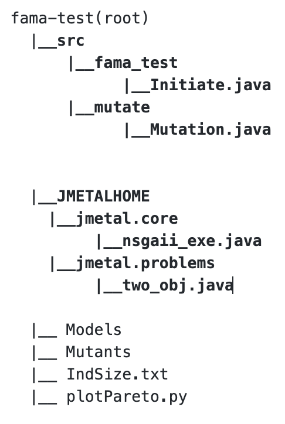

# FM-SBSE
CS 454 SBSE Project

The following project implements the the

## Dependencies  & Environment
### Libraries
__FaMa-1.1.2__ (loaded)

__JMetal__ (loaded)

Using __Eclipse__ 2019-09 R (4.13.0)

      __Java__ v. 1.8

### External JARs (Mac)
__FaMaSDK-1.1.1.jar__ from >fama_test/lib

__commons-lang3-3.9.jar__ from web

## Structure

  
## Implementation
- Initialization step creates appropriate mutants for a loaded FM xml
- The Mutation.xml applies 12 Mutant operators and produces possible products for each Mutant using FAMA Library
- The GA is run within __nsgaii_exe__ and __two_obj__ using 'Test Set Size' and 'Mutation Score' two objectives

